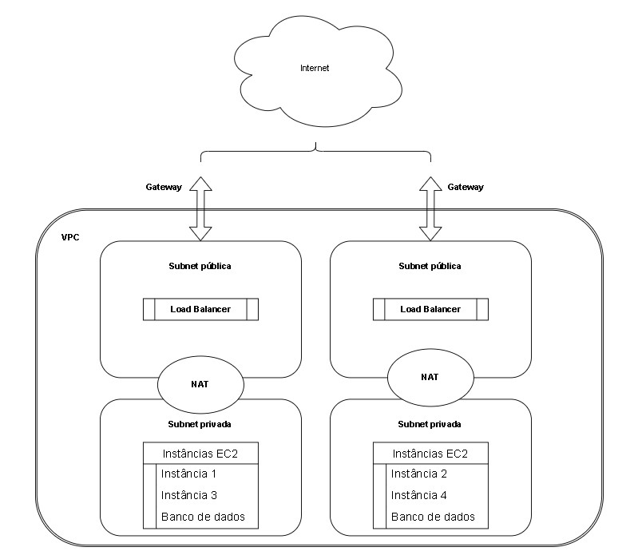

# Implementação de Arquitetura na AWS com Terraform

## Sobre o Projeto

Este relatório tem como objetivo esclarecer os pontos implementados no projeto e fornecer orientações para sua execução. A arquitetura abrange a configuração de um Application Load Balancer (ALB), instâncias EC2 com Auto Scaling e um banco de dados RDS.

## Diretrizes Técnicas do Projeto

### 1. Infraestrutura como Código (IaC) com Terraform

- Utilização do Terraform para criar e gerenciar todos os recursos na AWS.
- Código Terraform organizado em módulos para separar responsabilidades (módulos para EC2, IAM, RDS, Grupos de Segurança e VPC).
- Armazenamento do estado do Terraform em um bucket S3 para o lock do estado.
- Criação da infraestrutura com um único comando, sem intervenção manual (sem intervenções via dashboard ou no próprio código, mas com comandos iniciais necessários).
- Facilitação da destruição da infraestrutura com um único comando, sem intervenção manual.

### 2. Application Load Balancer (ALB)

- Provisionamento de um ALB para distribuir o tráfego entre as instâncias EC2.
- Configuração de Target Groups para gerenciar as instâncias EC2.
- Implementação de Health Checks.

### 3. EC2 com Auto Scaling

- Criação de um Launch Configuration com uma AMI contendo a aplicação pré-instalada.
- Estabelecimento de um Auto Scaling Group (ASG) usando o Launch Configuration criado.
- Definição de políticas de escalabilidade baseadas em CloudWatch Alarms.
- Asseguramento da integração do ASG com o ALB por meio do Target Group.

### 4. Banco de Dados RDS

- Provisionamento de uma instância RDS MySQL.
- Ativação de backups automáticos e definição de uma janela de manutenção.
- Configuração de Security Groups para permitir apenas que as instâncias EC2 se conectem ao RDS.
- Habilitação do Multi-AZ para garantir alta disponibilidade.

### 5. Aplicação

- Implementação de uma aplicação como uma API RESTful ou uma aplicação web simples.
- Capacitação da aplicação para se conectar ao banco de dados RDS e realizar operações CRUD.
- Introdução de métricas e logs utilizando o CloudWatch.

### 6. Análise de Custo com a Calculadora AWS

- Utilização da Calculadora de Custo da AWS para estimar os gastos mensais da arquitetura proposta.
- Consideração dos custos de todos os recursos utilizados (EC2, ALB, RDS, etc.).
- Preparação de um relatório abrangente com a previsão de custos, destacando os principais gastos e possíveis otimizações.

## Diagrama da arquitetura AWS 

## Considerações sobre a estimativa de preços AWS - Total de 12 meses: 2.000,28 USD  

#### Amazon EC2: 15,18 USD / mês
- Locação: Instâncias compartilhadas;
- Sistema operacional: Windows Server;
- Carga de trabalho: consistente;
- Número de instâncias: 4;
- Instância do EC2 avançada: t2.nano;
- Estratégia de preço: economia de 3 anos, sem adiantamento.

#### Elastic Load Balancer: 36,87 USD / mês
- Número de Application Load Balancers: 1.

#### Amazon Simple Storage Service (S3): 0,02 USD / mês
- Armazenamento S3 Standard: 1 GB por mês.

#### Amazon Virtual Private Cloud (VPC): 51,14 USD / mês
- Número de conexões do Site-to-Site VPN: 1;
- Número de gateways NAT: 1.

#### Amazon RDS for MySQL: 61,92 USD / mês
- Armazenamento para cada instância do RDS: SSD de uso geral (gp2);
- Quantidade de armazenamento: 30 GB;
- Quantidade: 1;
- Tipo de instância: db.m1.small;
- Utilização: somente sob demanda (40 %Utilized/Month); 
- Opção de implantação: Multi-AZ;
- Modelo de preço: OnDemand;
- Armazenamento de backup adicional: 10 GB;
- Tamanho total do backup processado para exportação: 5 GB por mês.

#### Amazon CloudWatch: 1,56 USD / mês
- Número de métricas: 1;
- Número de métricas solicitadas: 1 (GetMetricData);
- Número de métricas solicitadas: 1 (GetMetricWidgetImage);
- Número de outras solicitações de API: 3; 
- Logs padrão: dados consumidos: 1 GB;
- Logs entregues ao CloudWatch Logs: 1 GB de dados ingeridos;
- Logs entregues ao S3: 1 GB de dados consumidos.

As especificações de instância dos recursos AWS foram pautadas em aplicações simples, de pequeno porte, com baixo tráfego e poucos usuários. Além disso, buscou-se utilizar recursos gratuitos ou de baixo custo, como o uso de instâncias compartilhadas, o armazenamento S3 Standard e o modelo de preço OnDemand para o RDS.

## Execução do projeto

1. Instalar o Terraform: https://learn.hashicorp.com/tutorials/terraform/install-cli
2. AWS CLI: https://docs.aws.amazon.com/cli/latest/userguide/install-cliv2.html

#### Comandos para execução do projeto

1. Inicializar o Terraform: `terraform init`
2. Verificar o plano de execução: `terraform plan -var-file="secrets.tfvars"`
3. Executar o plano: `terraform apply -var-file="secrets.tfvars"`

O arquivo `secrets.tfvars` contém credenciais para o acesso ao banco de dados RDS e deve ser criado pelo usuário e referenciado no arquivo .gitignore.

#### Teste da aplicação

1. Criados os recursos, acessar o DNS do ALB para testar a aplicação
2. Para testar a conexão com o banco de dados
3. Para destruir a infraestrutura: `terraform destroy`

## Algumas referências
- https://antonputra.com/amazon/create-alb-terraform/#create-aws-alb-with-ec2-backend
- https://registry.terraform.io/providers/hashicorp/aws/latest/docs
- https://devopslearning.medium.com100-days-of-devops-day-21-mysql-rds-database-creation-using-terraform-278eeaff339f
- https://developer.hashicorp.com/terraform/tutorials/configuration-language/sensitive-variables
- https://terraformguru.com/terraform-real-world-on-aws-ec2/